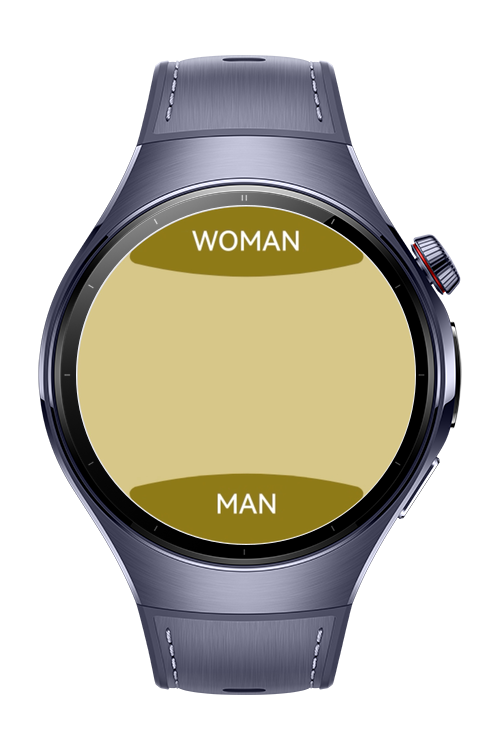
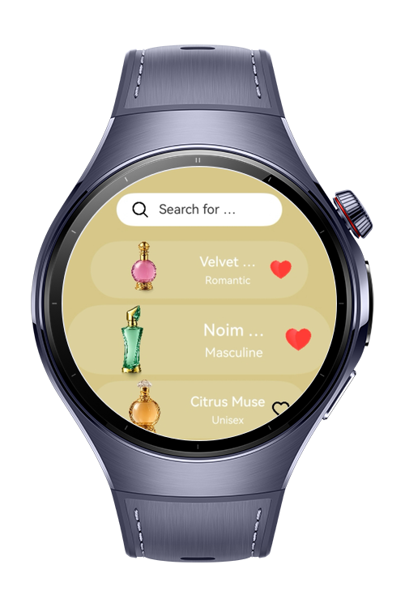
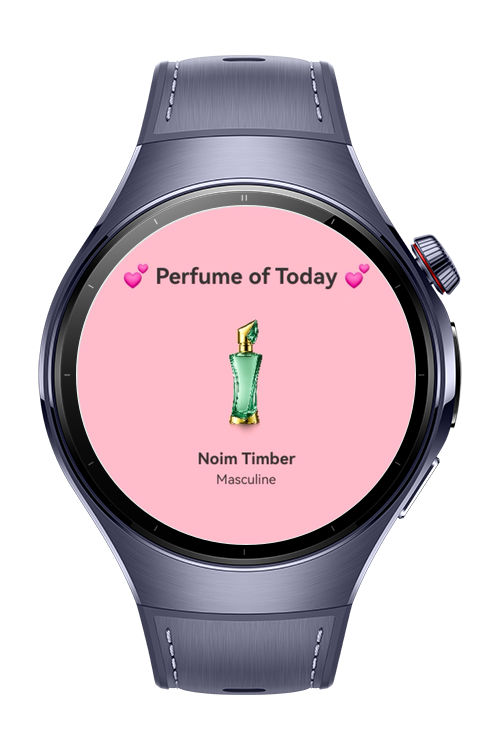
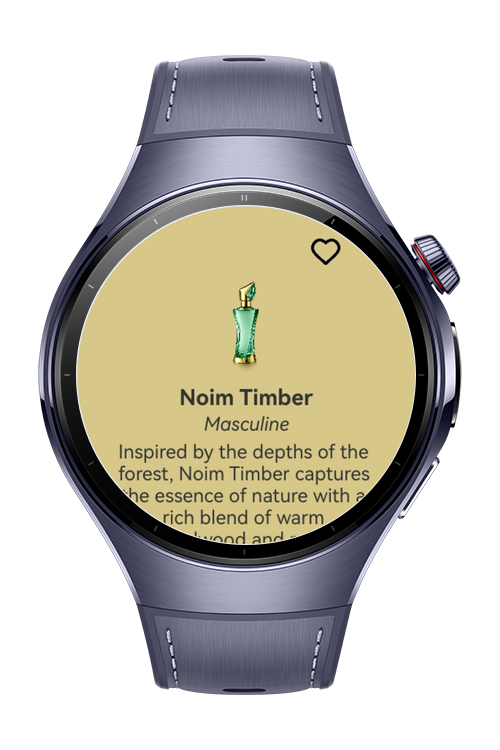

# Perfume Collection

A HarmonyOS NEXT wearable app for exploring and managing a perfume collection, built with ArkTS, ArkUI.

# Preview

<div>




</div>

# Use Cases

1. Splash screen animation on app launch
2. ArcSwiper-based home menu with three cards: Perfume of the Day, Perfumes, Favorites
3. Randomly selected Perfume of the Day using secure random number generation
4. Gender selection via ArcButton (WOMAN / MAN) before browsing the collection
5. Perfume list with search/filter, favorite toggle, and crown scroll support
6. Perfume detail page with scrollable description and favorite toggle
7. Favorites page showing all saved perfumes, refreshed on every visit
8. Haptic feedback on favorite add/remove via vibration

# Technology

## Stack
**Language:** ArkTS  
**Framework:** HarmonyOS SDK 5.0.2 (14)  
**Tools:** DevEco Studio 5.1.0.240 SP1  
**Libraries:** @kit.ArkUI, @kit.SensorServiceKit, @kit.CryptoArchitectureKit, @kit.BasicServicesKit

## Required Permissions
- `ohos.permission.VIBRATE`

**Architecture**

This project follows **MVVM** with a clean layer separation:

- **model** — data interfaces and dummy data (`PerfumeModel`)
- **viewmodel** — search/filter logic (`PerfumeViewModel`)
- **service** — favorites management (`PreferencesService`), haptic feedback (`HapticService`)
- **components** — reusable UI components
- **pages** — full-screen NavDestination pages
- **constants** — route names (`RouteNames`), app-wide constants (`AppConstants`)

# Directory Structure

```
entry/src/main/ets/
├── constants/
│   ├── AppConstants.ets
│   └── RouteNames.ets
├── model/
│   └── PerfumeModel.ets
├── viewmodel/
│   └── PerfumeViewModel.ets
├── service/
│   ├── PreferencesService.ets
│   └── HapticService.ets
├── components/
│   ├── GenderButton.ets
│   ├── PerfumeComponent.ets
│   ├── PerfumeDetailComponent.ets
│   └── SearchBar.ets
├── pages/
│   ├── SplashPage.ets
│   ├── HomePage.ets
│   ├── ChooseGenderPage.ets
│   ├── MenuPage.ets
│   ├── PerfumePage.ets
│   ├── PerfumeDetailPage.ets
│   ├── PerfumeOfTheDayPage.ets
│   └── FavoritesPage.ets
└── entryability/
    └── EntryAbility.ets
```
# Constraints and Restrictions
## Supported Device

Huawei Watch 5

# License

PerfumeCollection is distributed under the terms of the MIT License.  
See the [LICENSE](./LICENSE) for more information.