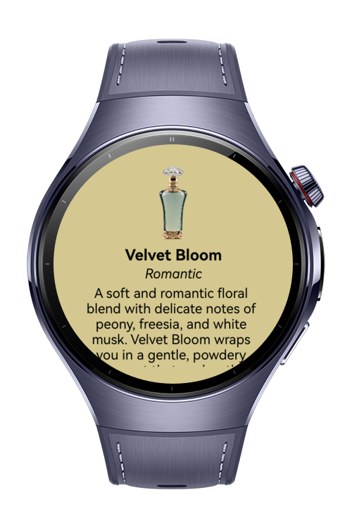

> **Note:** To access all shared projects, get information about environment setup, and view other guides, please visit [Explore-In-HMOS-Wearable Index](https://github.com/Explore-In-HMOS-Wearable/hmos-index).

# Perfume Collection

This project showcases a sample app for HarmonyOS Next wearables, allowing users to explore and manage their perfume
collection.

# Preview

<div>
   
   
   
   
</div>

# Use Cases

It is a perfume collection app for users who want to see perfume collection. The buttons do not have any functions. This
project is an UI project.

1) The user can see the splash page when the app opens.
2) The user can see the perfume of the day
3) The user can see perfume/deodorant/air freshener collections (dummy data)
4) The user can see details on the detail page
5) The user can add them to favorites (no function)

# Tech Stack

- **Languages**: ArkTS
- **Frameworks**: HarmonyOS SDK 5.0.2(14)
- **Tools**: DevEco Studio Vers 5.1.0.240SP1
- **Libraries**: @kit.ArkUI

# Directory Structure

   ```
entry/src/main/ets/
|---components
|---|---ButtonComponent
|---|---GenderButton
|---|---PerfumeComponent
|---|---PerfumeDetailComponent
|---|---SearchBar
|---model
|---|---PerfumeModel
|---pages
|---|---ChooseGenderPage
|---|---FavoritesPage
|---|---HomePage
|---|---MenuPage
|---|---PerfumeDetailPage
|---|---PerfumeOfTheDayPage
|---|---PerfumePage
|---|---SplashPage
|---viewmodel
|---|---PerfumeViewModel
|---entryability
|---|---EntryAbility
|---entrybackupability
|---|---EntryBackupAbility
   ```

# Constraints and Restrictions

## Supported Devices

- Huawei Watch 5

# License

PerfumeCollection is distributed under the terms of the MIT License
See the [LICENSE](./LICENSE) for more information.


